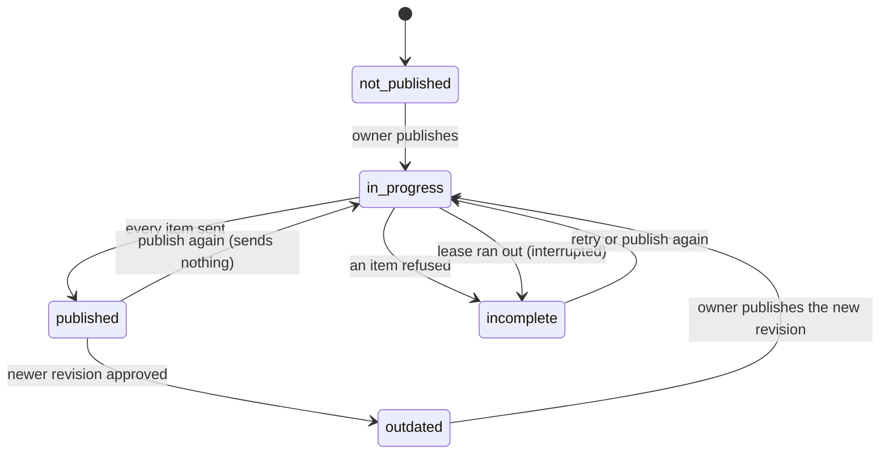
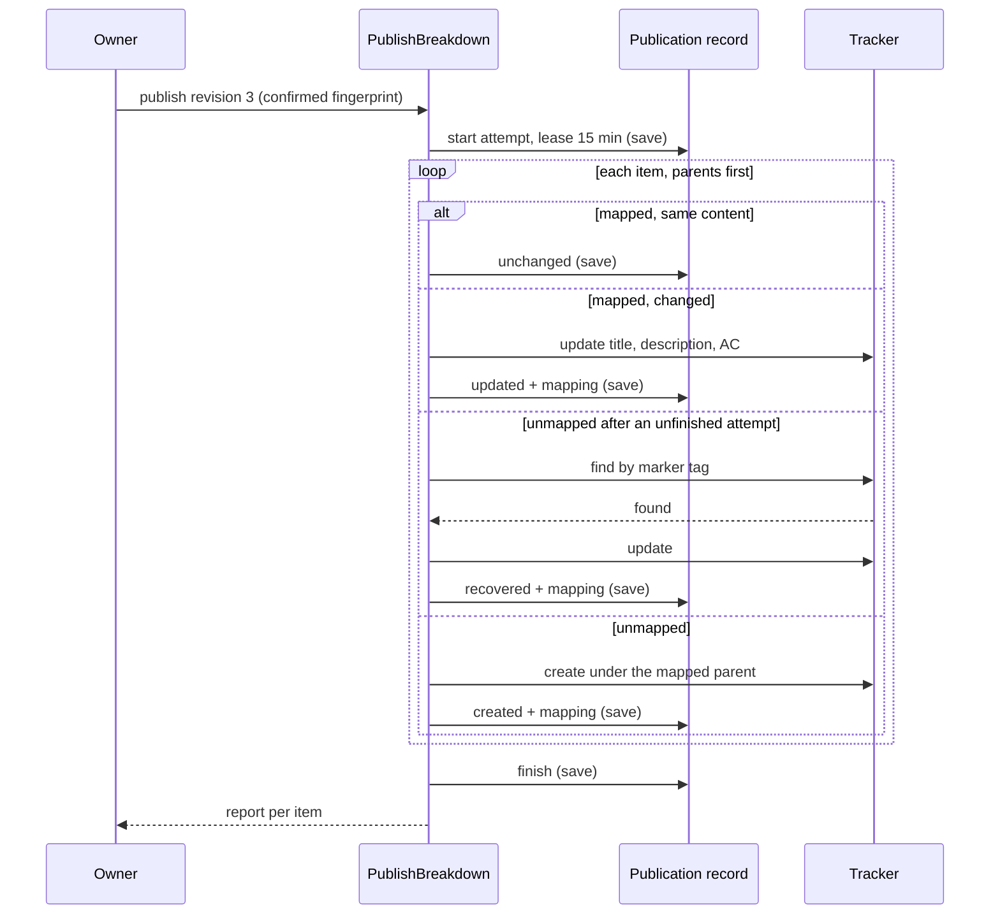

# Slice 13 — External ID Mapping and Safe Republish

## Objective

Remember which local backlog item became which tracker work item, so publishing again updates
what exists instead of duplicating it, and a publication that stopped part-way can be continued
safely (ADR-0113, building on ADR-0112).

The publication record also keeps the Requirement's accepted product verdict and that verdict's
version, which the ontology and impact implementation plan needs to trace a closed Epic back to
what was promised. Requirement analysis does not decide a verdict yet, so both fields stay empty
until the thread delivering it fills them; this slice does not build the Epic-closed hook
(Phase 7).

This slice includes frontend feature work beyond the presentation-only rule in `CLAUDE.md`, like
Slice 12: the publication panel gains a status, per-item changes and a Retry button.

## User Outcome

The system knows which local items already exist in ADO and avoids duplicates.

## In Scope

- A publication record per Requirement: external id mappings, every attempt with a result per
  item, the target it belongs to, and the nullable product verdict.
- Publishing an already published revision sends nothing; a changed item is sent as an update of
  the same tracker item; a new item is created under its mapped parent.
- Continuing an attempt that was refused or interrupted, without creating an item twice.
- A status route and a retry route; status, changes and removed items in the panel.

## Out of Scope

- Closing or deleting tracker items for items a newer revision removed: they are listed, and a
  person closes them in the tracker.
- Moving an item when its squad changes: once published, people triage it in the tracker.
- The Epic-closed hook back from ADO and filling the product verdict (implementation plan,
  Phases 4 and 7).
- A background retry queue (ADR-0113, Alternatives).

## Domain

`governance/domain/publication/` — no ADO concept, and no external id on Epic, Feature or Story
(AGENTS.md §9).

- `ExternalWorkItemMapping`: local key, kind, external id, URL, the content fingerprint last sent,
  the revision it came from and when.
- `PublicationResult`: one attempt (number, revision, actor, start, lease, finish, interrupted)
  with an `ItemOutcome` per item: `created`, `updated`, `unchanged`, `recovered`, `failed` or
  `not_attempted`. Its outcome is `published`, `partial`, `failed` or `interrupted`.
- `PublicationStatus`: `not_published`, `in_progress`, `published`, `incomplete` (the last attempt
  did not send everything) or `outdated` (a newer revision has final approval).
- `BacklogPublication`: the record. Invariants: one mapping per local key and per external id,
  attempts numbered in order, only the latest may run, and a verdict is kept only with its
  version. Every change advances `version` by one.



## Application Use Cases

The roadmap's four use cases, as built:

| Roadmap name | Built as |
|---|---|
| GetPublicationStatus | `GetPublicationStatus` (any member) |
| DetectAlreadyPublished | `PreviewPublication`: each item's action (`create`, `update`, `unchanged`) with its existing tracker link, plus items no longer in the revision |
| UpdatePublishedBacklog | `PublishBreakdown`: unchanged items are skipped, changed ones updated, new ones created |
| RetryFailedPublication | `RetryFailedPublication` (owner only) |

One run, for publish and retry alike:



## Ports

- `BacklogPublisherPort` gains `update(external_id, item)` and `find(item)`.
- `PublicationRepositoryPort` (`governance/application/ports/publication_repository.py`): `get`
  and `save`; a save that does not advance the stored version by one raises
  `ArtifactVersionConflictError`.

## Adapters

- `AzureDevOpsWorkItemPublisher`: the target key is `azure-devops:{organization}/{project}`. A
  create also tags the item with its marker. An update is `PATCH …/workitems/{id}` with the title,
  description and acceptance criteria only. `find` is a WIQL query on the marker tag in the
  project; several matches are refused so a person removes the duplicates.
- `FakeBacklogPublisher` and `UnavailableBacklogPublisher` implement the new operations.
- `PostgresPublicationRecords` (table `backlog_publications`, migration `202610101200`, expand
  only) and `InMemoryPublicationRecords`, enrolled in the memory store's transactions.

## API

- `GET /requirements/{id}/revisions/{n}/publication`: as Slice 12, plus `status`,
  `published_revision`, each item's `action`, `external_id` and `url`, and `removed`.
- `POST /requirements/{id}/revisions/{n}/publication`: as Slice 12; step statuses are now the item
  results above.
- `GET /requirements/{id}/publication`: status, latest approved and published revisions, mappings,
  the latest 20 attempts newest first, `product_verdict` and `product_impact_version`.
- `POST /requirements/{id}/publication/retry`: continues the latest attempt.
- Errors: `publication_in_progress` (409), `publication_retry_not_allowed` (409),
  `publication_target_changed` (409), and `invalid_publication` (500, a broken record).

Example status for a Requirement whose first attempt was refused at the second Feature:

```json
{
  "requirement_id": "REQ-1042",
  "status": "incomplete",
  "latest_approved_revision": 3,
  "published_revision": null,
  "product_verdict": null,
  "product_impact_version": null,
  "mappings": [
    {"local_key": "epic-7c1", "kind": "epic", "external_id": "48211",
     "url": "https://dev.azure.com/contoso/SMB/_workitems/edit/48211",
     "revision": 3, "published_at": "2026-10-10T09:00:04Z"},
    {"local_key": "feat-1a2", "kind": "feature", "external_id": "48212",
     "url": "https://dev.azure.com/contoso/SMB/_workitems/edit/48212",
     "revision": 3, "published_at": "2026-10-10T09:00:05Z"}
  ],
  "attempts": [
    {"number": 1, "revision": 3, "actor_name": "Dana Owner",
     "started_at": "2026-10-10T09:00:03Z", "finished_at": "2026-10-10T09:00:07Z",
     "outcome": "partial",
     "items": [
       {"local_key": "epic-7c1", "result": "created", "error": null},
       {"local_key": "feat-1a2", "result": "created", "error": null},
       {"local_key": "feat-9d4", "result": "failed",
        "error": "Azure DevOps refused the item (400). TF401320: Area path does not exist."},
       {"local_key": "story-3e8", "result": "not_attempted", "error": null}
     ]}
  ]
}
```

## UI

The publication panel on the Revisions page shows the status with who published last, an
"On publish" column (New, Changed or Unchanged, with a link to the existing item), the items an
earlier version published that this one no longer has, and, for the owner:

- **Publish to …** for a first publication, or **Publish changes** afterwards, with a confirmation
  naming how many items are created and updated;
- **Retry** when this version's last attempt did not finish;
- nothing to press, and a sentence saying so, when the tracker already matches.

The report after a run shows Created, Updated, Unchanged, Recovered, Refused or Not sent per item.

## Business Rules

- External ids live only in the publication record.
- Publishing the published revision again sends nothing. An item whose title, description or
  acceptance criteria changed is updated in place; where it lands is not changed.
- Every item's result is saved before the next item is sent, so a crash loses at most the item in
  flight, and that item carries its marker.
- After an attempt that was interrupted or had an item fail, an unmapped item is first looked up
  by its marker, because a create whose answer was lost may have succeeded.
- One attempt at a time: a running attempt holds a 15-minute lease; one whose lease ran out is
  closed as interrupted when the next starts.
- Retry needs no new confirmation, because it continues the revision the owner already confirmed.
  It is refused once a newer revision has final approval: that one is previewed and confirmed.
- A record belongs to one target. Pointing the portal at another project or organization refuses
  publication rather than duplicating the backlog there.

## Tests

- `tests/unit/governance/test_safe_republish.py`: publishing twice sends nothing, the status route
  with mappings, attempts and an empty verdict, retry after a refusal, nothing to retry first,
  a changed item updated in place, an interrupted attempt recovered by marker, a lost create
  answer recovered on retry, a running attempt holding off another, a changed target refused, the
  record's status lifecycle and invariants.
- `tests/unit/governance/test_backlog_publication.py`: the Slice 12 cases with the new results.
- `tests/unit/governance/test_azure_devops_publisher.py`: the marker tag, the update's PATCH
  fields, the WIQL lookup and its ambiguous or unusable answers, an invalid marker never sent.
- `tests/integration/test_publication_records_postgres.py`: the record reloads whole, saves
  advance one version, a stale save conflicts, a failed transaction keeps nothing.
- `tests/unit/test_error_handlers.py`: the four new public errors.
- `frontend/src/features/publication/PublicationPanel.test.tsx`: the changes column, removed
  items, the update confirmation, nothing to send, and Retry for this version only.

## Acceptance Criteria

- [x] Mappings live in a separate publication record, not on Epic, Feature or Story.
- [x] Republishing is idempotent: nothing is created twice.
- [x] A changed item is updated in the tracker; a removed one is reported.
- [x] A partial or interrupted publication is continued safely.
- [x] Mappings and attempts persist in PostgreSQL.
- [x] The record keeps a nullable product verdict and its version.

## Validation Evidence

Run on 2026-10-10 against this branch:

- `pytest` — PASS locally without PostgreSQL; the integration test runs in CI
- `ruff check .` — PASS
- `ruff format --check .` — PASS
- `mypy src tests` — PASS
- `lint-imports` — PASS
- `cd frontend && npm run lint && npx vitest run && npm run build && npm run api:check` — PASS

## Deferred

- Closing tracker items a newer revision removed.
- Filling `product_verdict` from requirement analysis, and the Epic-closed hook (implementation
  plan, Phases 4 and 7).
