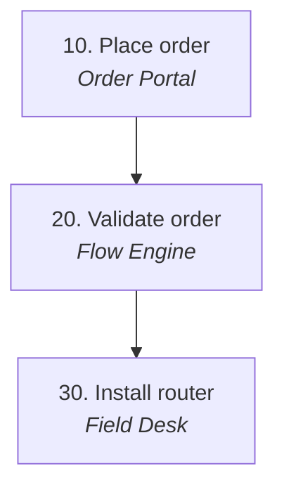

# Synthetic Landscape

*A made-up architecture landscape with the same shapes as a real product explorer export.*

Every name below is invented for tests.

---

## Systems

### Domains

| Domain | Code | ID |
|---|---|---|
| Ordering | TAM · Ordering | ORDERING |
| Fulfilment | TAM · Fulfilment | FULFILMENT |

### Ordering (TAM · Ordering)

| System | ID | Sub-domain | Owner | Function | Integrations | Aliases |
|---|---|---|---|---|---|---|
| 🛒 Order Portal | SYS-PORTAL | Un-assisted | Digital | Web channel where business customers place and track orders. | Order Gateway, Pricing Engine | — |
| 🧾 Order Gateway | SYS-GATEWAY | Data & Case | Enterprise Data | Central customer, account and order store. | Flow Engine, Order Portal | OGW, Gateway |
| 💲 Pricing Engine | SYS-PRICING | — | — | Eligibility rules, prices and package codes. | Flow Engine / Order Gateway | — |

### Fulfilment (TAM · Fulfilment)

| System | ID | Sub-domain | Owner | Function | Integrations | Aliases |
|---|---|---|---|---|---|---|
| 🔄 Flow Engine | SYS-FLOW | — | Flow team | Validates orders and routes fixed orders to provisioning. | Order Gateway, Field Desk, Notifier | — |
| 🛠️ Field Desk | SYS-FIELD | — | Engineering | Field work orders and installation evidence. | Flow Engine | Field Desk Pro |
| ✉️ Notifier | SYS-NOTIFY | — | — | Template-driven SMS and email notifications. | Flow Engine | — |

---

## Product: Office Connect

*A fixed connection with a managed router.*

| Code | Family | Version | Lifecycle | Evidence | Source |
|---|---|---|---|---|---|
| OFFICE_CONNECT | Connect | 1.0.0 | REFERENCE | CONFIRMED | Synthetic design §1 |

### Components

| Component | Code | Type | Mandatory | Customer visible | Description | Evidence | Source |
|---|---|---|---|---|---|---|---|
| Fibre Access | PO_FIBRE | SERVICE | Yes | Yes | Primary fixed connection. | CONFIRMED | Synthetic design §2 |
| Managed Router | PO_ROUTER | RESOURCE | Yes | Yes | Router installed on site. | CONFIRMED | Synthetic design §2 |

### Component → system responsibilities

| Component | System | Role | Responsibility | Order types | Evidence | Source |
|---|---|---|---|---|---|---|
| Fibre Access | Flow Engine | PRIMARY_ORCHESTRATOR | Routes the fixed order to provisioning. | New Activation | CONFIRMED | Synthetic design §3 |
| Managed Router | Field Desk | FIELD_FULFILLMENT | Installs the router and records its serial. | New Activation | CONFIRMED | Synthetic design §3 |

---

## Journey: New Activation

### Activities

| # | Phase | Track | Activity | Performing system | Supporting systems | Mode | Evidence |
|---|---|---|---|---|---|---|---|
| 10 | CAPTURE | MAIN | Place order | Order Portal | — | HYBRID | CONFIRMED |
| 20 | VALIDATION | MAIN | Validate order | Flow Engine | Pricing Engine | AUTOMATED | CONFIRMED |
| 25 | VALIDATION | MAIN | Check order rules | Flow Engine | — | AUTOMATED | CONFIRMED |
| 30 | FULFILLMENT | FIELD | Install router | Field Desk | — | MANUAL | INFERRED |

### Integration details

| From | To | Interaction | Interface / API / event | Payload | Sync/Async | Evidence | Source |
|---|---|---|---|---|---|---|---|
| 10 | 20 | API | Order API | Basket | SYNC | CONFIRMED | Synthetic design §4 |
| 20 | 25 | INTERNAL_APP | — | Validated order | SYNC | CONFIRMED | Synthetic design §4 |
| 25 | 30 | WORK_ORDER | — | Installation request | ASYNC | GAP | Synthetic design §4 |

### Activity details

#### 20. Validate order

Check the basket against the offer's rules before it is routed.

- **Phase / track:** VALIDATION / MAIN
- **Performing system:** Flow Engine; supporting: Pricing Engine
- **Related components:** Fibre Access , Managed Router
- **Input → Output:** Basket → Validated order
- **eTOM:** Customer Relationship Management › Order Handling
- **Evidence:** CONFIRMED — Synthetic design §5

#### 40. Close order

Tell the customer the order is complete.

- **Phase / track:** CLOSURE / MAIN
- **Performing system:** Notifier; supporting: —
- **Evidence:** INFERRED — Synthetic design §5

### Flow rules

| Rule type | From | Condition / outcome | To | Branch | Parallel group | Rejoin at | Evidence | Source |
|---|---|---|---|---|---|---|---|---|
| DECISION | 25 | PASS | 40 | PASS | — | — | CONFIRMED | Synthetic design §6 |
| DECISION | 25 | FAIL | 10 | CORRECTION | — | — | CONFIRMED | Synthetic design §6 |
| PARALLEL | 25 | — | 30 | FIELD | PG1 | 40 | INFERRED | Synthetic design §6 |
